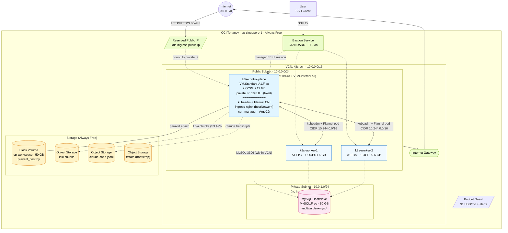

# Oracle Cloud Infrastructure Architecture

目前 OCI tenancy 的整體基礎建設結構（Always Free, ap-singapore-1）。

```mermaid
flowchart TB
    Internet((Internet<br/>0.0.0.0/0))
    User[User<br/>SSH Client]

    subgraph OCI["OCI Tenancy · ap-singapore-1 · Always Free"]
        direction TB
        ReservedIP[/"Reserved Public IP<br/>k8s-ingress-public-ip"/]
        Bastion["Bastion Service<br/>STANDARD · TTL 3h"]

        subgraph VCN["VCN: k8s-vcn · 10.0.0.0/16"]
            IGW{{Internet Gateway}}

            subgraph PubSubnet["Public Subnet · 10.0.0.0/24<br/>(k8s-security-list: 22/80/443 + VCN-internal all)"]
                CP["k8s-control-plane<br/>VM.Standard.A1.Flex<br/>2 OCPU / 12 GB<br/>private IP: 10.0.0.3 (fixed)<br/>━━━━━━━━━━━━<br/>kubeadm + Flannel CNI<br/>ingress-nginx (hostNetwork)<br/>cert-manager · ArgoCD"]
                W1["k8s-worker-1<br/>A1.Flex · 1 OCPU / 6 GB"]
                W2["k8s-worker-2<br/>A1.Flex · 1 OCPU / 6 GB"]
            end

            subgraph PrivSubnet["Private Subnet · 10.0.1.0/24<br/>(no internet ingress/egress)"]
                MySQL[("MySQL HeatWave<br/>MySQL.Free · 50 GB<br/>vaultwarden-mysql")]
            end
        end

        subgraph Storage["Storage (Always Free)"]
            BV[("Block Volume<br/>cp-workspace · 50 GB<br/>prevent_destroy")]
            ObjLoki[("Object Storage<br/>loki-chunks")]
            ObjClaude[("Object Storage<br/>claude-code-jsonl")]
            TFState[("Object Storage<br/>tfstate (bootstrap)")]
        end

        Budget[/"Budget Guard<br/>$1 USD/mo + alerts"/]
    end

    Internet -->|"HTTP/HTTPS 80/443"| ReservedIP
    ReservedIP -.->|bound to private IP| CP
    User -->|"SSH 22"| Bastion
    Bastion -.->|managed SSH session| CP
    Bastion -.-> W1
    Bastion -.-> W2

    PubSubnet --> IGW --> Internet

    CP <-->|"kubeadm + Flannel pod CIDR 10.244.0.0/16"| W1
    CP <-->|"kubeadm + Flannel pod CIDR 10.244.0.0/16"| W2

    CP -- "paravirt attach" --- BV
    CP -.->|"MySQL 3306 (within VCN)"| MySQL
    W1 -.-> MySQL
    W2 -.-> MySQL

    CP -.->|"Loki chunks (S3 API)"| ObjLoki
    CP -.->|"Claude transcripts"| ObjClaude

    classDef cp fill:#e1f5ff,stroke:#0066cc,color:#000
    classDef worker fill:#f0f9ff,stroke:#3182ce,color:#000
    classDef storage fill:#fef3c7,stroke:#d97706,color:#000
    classDef db fill:#fce7f3,stroke:#be185d,color:#000
    classDef net fill:#ecfccb,stroke:#65a30d,color:#000
    class CP cp
    class W1,W2 worker
    class BV,ObjLoki,ObjClaude,TFState storage
    class MySQL db
    class ReservedIP,Bastion,IGW net
```
